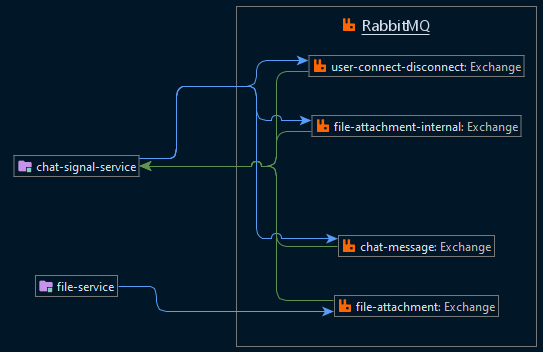

# Java Spring pet project

## Description
Chat is built using microservice architecture, supports file upload, uses MySQL and RabbitMQ. Deployed with docker-compose.
- Clients connections are organized via STOMP over WebSockets.
- Clients can connect to different chat-signal replicas and still able to communicate with each other in the same chatroom.
- Replicas communicate via RabbitMQ.
- File attachments are processed using dedicated file service.

## Running locally

Build jars
```
cd scripts
./build-jars.sh
```

Build frontend

> NOTE: requires npm

```
cd frontend
npm i && npm run build
```

Run docker-compose
```
cd deploy
docker-compose up
```

Application will be available at http://localhost:3000

> NOTE: it will take about 1 minute for chat-signals to be available on the frontend due to Eureka's server workflow.

## More detailed description
List of services:

| Name | Description |
|------|-------------|
| frontend | Client's server. Built using React.js
| file-service | Service responsible for accepting, storing and serving files. Sends signals about files' processing statuses via RabbitMQ
| chat-signal-service | Provides socket connections for the chat. Persists messages in the database and notifies clients about any updates related to the chat (users connect/disconnect, new messages, status of uploaded files). Can be replicated, replicas communicate with each other via RabbitMQ
| discovery-server | Eureka server. Used for dynamic resolution of chat-signal-services' ports
| discovery-api | Provides api to get chat-signal-services' ports
| mySQL | Persists chat messages, file records, connected users
| rabbitMQ | Used for communication between file-service and chat-signal-service and between the latter's replicas
| common | package for common POJOs between services

### RabbitMQ diagram:


### Why use message broker at all?
Mostly to satisfy the quirky requirement I had for this project: users within 1 chatroom could be connected to different services, but still be able to communicate as they would using a single service. Even though this case is nearly unrealistic in commercial projects.
